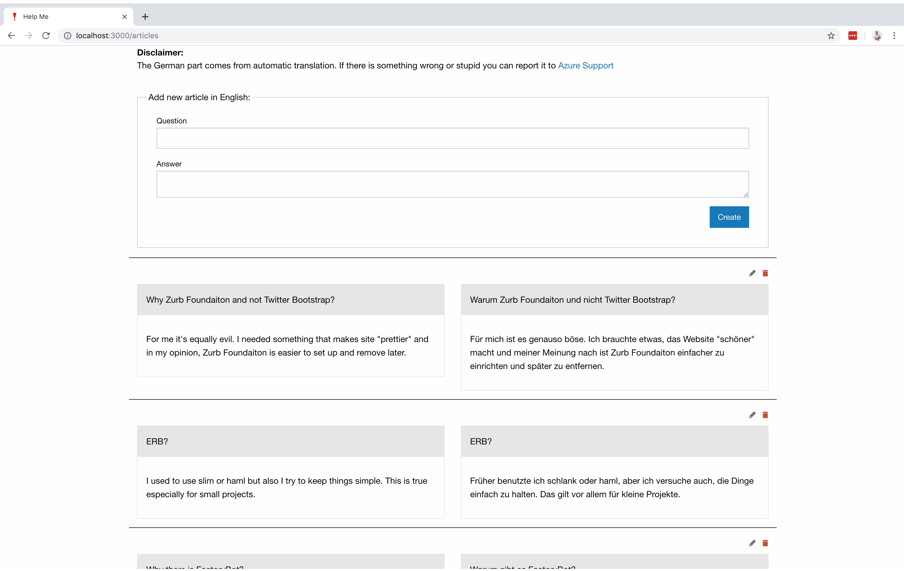

# Help Me

**_Help Me_** app helps build a knowledge base in English and automatically translate it to German. To see the demo, visit [https://help-me-demo.herokuapp.com/](https://help-me-demo.herokuapp.com/).

To add more articles, please use the form on the top of the page. A new piece will be shown just below the form and will be translated automatically without page reload so that you can add more articles without any seamlessly. To edit or remove an item click the proper icon on the right.

## Development  

Install [Docker](https://www.docker.com/) and execute `$ MICROSOFT_TRANSLATOR_API_KEY='KEY' docker-compose up` in terminal emulator to run the app locally. Visit http://localhost:4000 to see it.

###  Development without Docker

#### Install all dependencie

`$ brew install ruby`
`$ brew install postgresql`
`$ brew install redis`

#### Setup the application

`$ MICROSOFT_TRANSLATOR_API_KEY='KEY' bundle exec bin/setup`

#### Run the application

`$ MICROSOFT_TRANSLATOR_API_KEY='KEY' bundle exec rails server`
